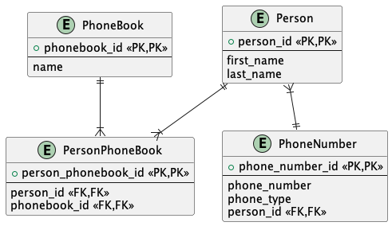

# Вариант
. Необходимо создать программу для хранения телефонов знакомых людей.
Каждый человек в этом телефонном справочнике может иметь до 3-х номеров телефонов.
Справочник должен выводить записи в алфавитном порядке, в случае совпадения имени
и фамилии сортировка производится по номерам телефонов. 
Справочник должен позволять производить поиск абонентов по фамилии и
телефонному номеру, а также добавление, удаление и редактирование абонентов.

# База

